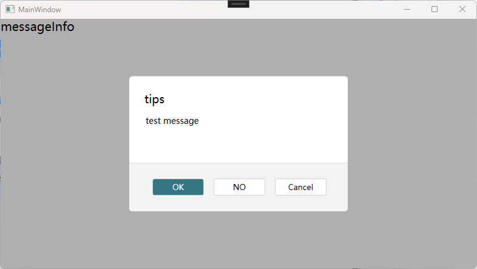

# Tiny.Toolkits

This project a simple extension of some methods aimed at reducing code input, including a simple implementation of Command and ViewModelBase in MVVM, a relay for event forwarding EventRepeater, an EasyFolder for simple folder processing, and an extension method for collection operations

The project is structured as follows:

- `Tiny.Toolkits`: Contains some basic simple implementations and extensions of methods 
- `Tiny.Toolkits.Wpf`: Including file selector, file save selector, folder selector, enum selector, EventBinding, etc


## 1. Tiny.Toolkits
### 1.1 MVVM 
```csharp
// View Model
public class TinyViewModel : ViewModelBase
{
    public string Name
    {
        get => GetValue<string>();
        set => SetValue(value);
    }

    int age;
    public int Age
    {
        get => age;
        set => SetValue(ref age,value);
    }

    public ICommand ClickCommand => RelayCommand.Bind(() => 
    {
        MessageBox.Show("ok");
    });
}

```
### 1.2 EasyFolder 
```csharp
public string GetDesktopFolder()
{
    return EasyFolder.Desktop;
}

public string CombinePath(string path1,string path2)
{
    return EasyFolder.Desktop.Combine(path1, path2);
}

```
### 1.3 EventRepeater 
This implementation is a bit rough, but it can basically be used
```csharp
var eventRepeater = new EventRepeater();

eventRepeater.Subscribe(subscriber:this, token: "token1", subscribeDelegate :() => 
{
    //do something
}); 
eventRepeater.Publish(publishToken: "token1");


eventRepeater.Subscribe<int,double>(subscriber: this, token: "token2",  subscribeDelegate: (intValue,doubleValue) =>
{
    //do something
});
eventRepeater.Publish(publishToken: "token2",12,15d);


eventRepeater.Subscribe<int, double,long>(subscriber: this, token: "token3", subscribeDelegate: (intValue, doubleValue) =>
{
    //do something
    //....
    //end

    return long.MaxValue;
});
var longValue= eventRepeater.Publish<long>(publishToken: "token3", 12, 15d);
```

### 1.4 Extensions  
```csharp
var enumerableCollection = Enumerable.Range(0, 1000)
.Select(i => new
{
    Target = $"{i}",
    Count = i
});
enumerableCollection.ForEach(item =>
{
    // do something
});
enumerableCollection.ForEach((item,index) =>
{
    // do something
});
if (enumerableCollection.IsNullOrEmpty())
{
    // do something
}


int a = 100;
int b = a.FromRange(0, 50);
//b=50

var a1 = 100;
bool result = a1.InRange(200, 1000);
//result=false


TinyTools.For(10, 100, () =>
{
    Console.WriteLine("loop");
});

TinyTools.For(10, 100, (item) =>
{
    Console.WriteLine($"{item}");
});

TinyTools.For(10, 100, (item,index) =>
{
    Console.WriteLine($"item:{item}  index:{index}");
});

```
 
 
## 2. Tiny.Toolkits.Wpf
### 2.1 PickFactory for windows
```csharp
//pick file
string selectedFile = PickFactory.FilePicker();

//pick files
string[] selectedFiles = PickFactory.FilesPicker();

//pick file name
string selectedFileName = PickFactory.FileNamePicker();

//pick folder
string selectedFolder = PickFactory.FolderPicker();


```
### 2.2. `EventBinding` for WPF

Using the `EventBinding` expression in XAML.     
The bind method must be marked by `CommandBindingAttribute`.

`$self` represents inserting the `sender` in the event parameter into the parameter      
`$eventArgs` represents the `EventArgs` inserted into the event parameter in the parameter    
#FFFFFF is converted to `System.Windows.Media.Color` by default     
Suffixes can be added for differentiation    
for example     
`#FFFFFF:color` will be converted to `System.Windows.Media.Color`, which can also be abbreviated as `#FFFFFF:c`     
`#FFFFFF:brush` will be converted to `System.Windows.Media.Brush`, which can also be abbreviated as `#FFFFFF:b`    

- View (XAML):

```xml
<Window
    x:Class="TinyDemo.MainWindow"
    xmlns="http://schemas.microsoft.com/winfx/2006/xaml/presentation"
    xmlns:x="http://schemas.microsoft.com/winfx/2006/xaml"
    xmlns:d="http://schemas.microsoft.com/expression/blend/2008"
    xmlns:mc="http://schemas.openxmlformats.org/markup-compatibility/2006"
    xmlns:wpf="https://github.com/xtremlyted/tiny.toolkits"
    x:Name="Window1"
    Title="MainWindow"
    Width="800"
    Height="450"
    mc:Ignorable="d">
    <Window.Resources>
        <SolidColorBrush x:Key="TestBrushKey" />
    </Window.Resources>
    <StackPanel>

        <Button
            Width="120"
            Height="35"
            Click="{wpf:EventBinding ShowClick,
                                     #666,
                                     $self,
                                     $eventArgs,
                                     {Binding ElementName=Window1},
                                     {StaticResource TestBrushKey}}" />

        <Border
            Width="120"
            Height="35"
            Background="Gray"
            Loaded="{wpf:EventBinding BorderLoaded 
                                      $self,
                                      $eventArgs,
                                      #FF00FF:b}" />

        <Border
            Width="120"
            Height="35"
            Background="Green"
            MouseDown="{wpf:EventBinding MouseDown 
                                         $self,
                                         $eventArgs}" />

    </StackPanel>

</Window>

```

- View Model (\*.cs):

```csharp
class TinyViewModel:ViewModelBase
{ 
    [CommandBindingAttribute]
    void ShowClick(Color color, Button button, RoutedEventArgs eventArgs,Window window, SolidColorBrush brush)
    {

    }

    [CommandBindingAttribute]
    void BorderLoaded(Border border, EventArgs eventArgs,Brush brush)
    {

    }

    [CommandBindingAttribute]
    void MouseDown(Border border, EventArgs eventArgs)
    {

    }
}
```

### 2.3. `Popup` for WPF

Use decorator to popup content and message in wpf

- View (XAML):

```xml
<Window
    x:Class="WpfApp1.Test.MainWindow"
    xmlns="http://schemas.microsoft.com/winfx/2006/xaml/presentation"
    xmlns:x="http://schemas.microsoft.com/winfx/2006/xaml"
    xmlns:d="http://schemas.microsoft.com/expression/blend/2008"
    xmlns:local="clr-namespace:WpfApp1.Test"
    xmlns:mc="http://schemas.openxmlformats.org/markup-compatibility/2006"
    xmlns:tiny="https://github.com/xtremlyred/tiny.toolkits"
    Title="MainWindow"
    Width="800"
    Height="450"
    mc:Ignorable="d">
    <Grid tiny:PopupManager.ContainerName="123" tiny:PopupManager.IsMainContainer="True">

        <TextBlock FontSize="20" Text="messageInfo" />

        <Button
            Width="150"
            Height="25"
            HorizontalAlignment="Center"
            VerticalAlignment="Center"
            Click="Button_Click"
            Content="click and popup" />
    </Grid>
</Window>

```

- MainWindow (\*.cs):

```csharp
public partial class MainWindow : Window
{
    public MainWindow()
    {
        InitializeComponent();
    }

    private void Button_Click(object sender, RoutedEventArgs e)
    {
        PopupManager popupManager = new PopupManager();
        popupManager.ShowAsync("test message", "tips", new[] {"OK","NO","Cancel" });
    }
}
```

- Show 


